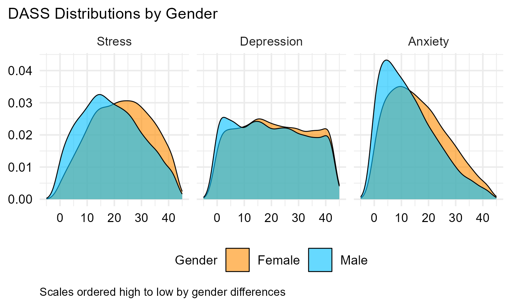
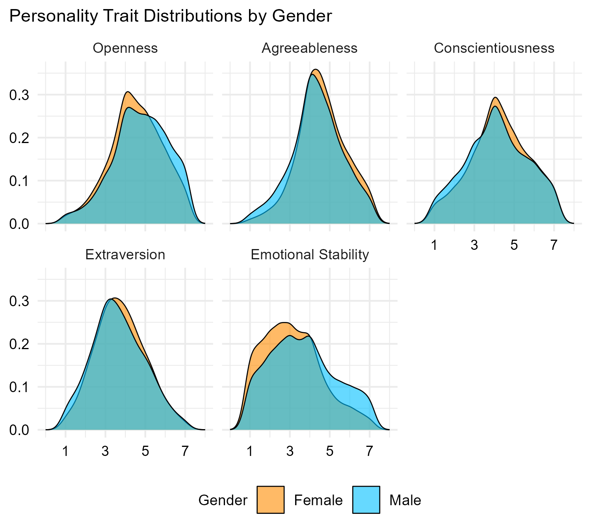
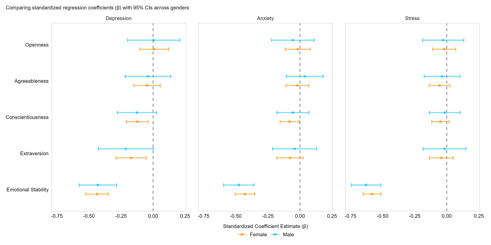

## Project Summary

> I conducted statistical analysis such as confirmatory factor analysis, independent samples t-tests, and multiple regression to replicate findings of gender differences in personality, and experiencing depression, anxiety, and stress.

**Role:** Researcher

**Team:** Solo

**Repo:** [https://github.com/ballen-git/gender-differences-or-schmifferences](https://github.com/ballen-git/gender-differences-or-schmifferences)

## The question

Can open-source software, paired with open-source data, be leveraged at an intermediate level to satisfy requirements for replication research?

## The data

Answers to the Depression Anxiety Stress Scales data avaialbe from the [Open Psychometrics Project](https://openpsychometrics.org/_rawdata/). This includes 39,775 responses to the 42-item Deparession Anxiety Stress Scales (DASS) measure, as well as the Ten-Item Personality Inventory.

## The approach

I conducted confirmatory factor analysis to show the DASS-42 measure could justifiably be used to compare mean differences between males and females, and then conduct independent samples t-tests to explore gender differences in personality trait scores and scores for depression, anxiety, and stress. Multiple regression was also conducted to explore how well personality traits predicted depression, anxiety, and stress differently for males and females.

## Findings

### DASS-21 Score Distribution

{fig-alt="Placeholder capstone figure" width="90%"}

### Personality Score Distribution

{fig-alt="Placeholder capstone figure" width="90%"}

### Regression Coefficients, Personality Predicting DAS

{fig-alt="Placeholder capstone figure" width="90%"}

> This study replicated findings that there are gender small to moderate gender differences in personality, and experiencing depression, anxiety, and stress, and that out the Big 5 personality traits, emotional stability exerts the most influence over depression, anxiety, and stress for both males and females.

## The full write-up

::: {.panel-tabset}

### Embedded PDF

[Download the write-up (PDF)](/projects/capstone/gender-differences.pdf){.btn .btn-primary}

<iframe src="/projects/capstone/gender-differences.pdf" width="100%" height="800px"
  style="border: 1px solid #ddd;"></iframe>
:::

## Dig deeper

- 📦 **Code & Data:** [https://github.com/ballen-git/gender-differences-or-schmifferences](https://github.com/ballen-git/gender-differences-or-schmifferences)
- 🔗 **Supplement:** [Gender Differences Supplement](/projects/capstone/gender-differences-supplement.pdf)
- 📊 **Slides / poster:** [Gender Differences Poster](projects/capstone/DATA510-poster.pdf)
- **Related Project:** [Males and Females (Machine) Learning to Express Emotions Granularly](/projects/data-515-final/index.qmd)
